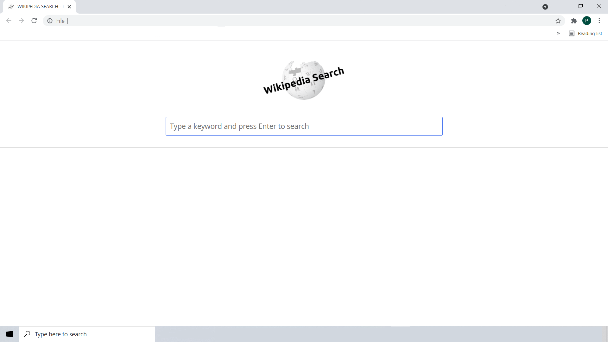
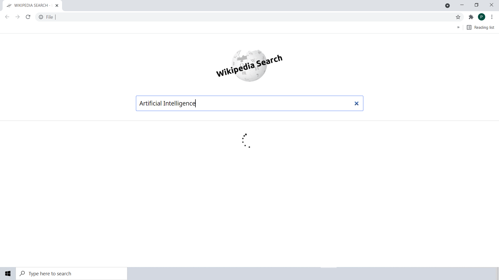
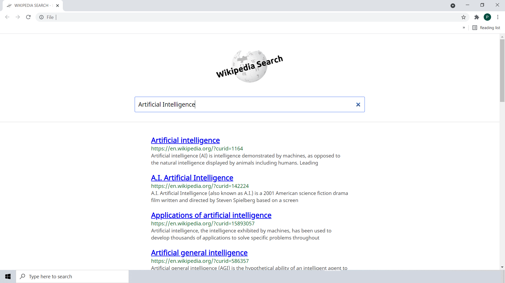
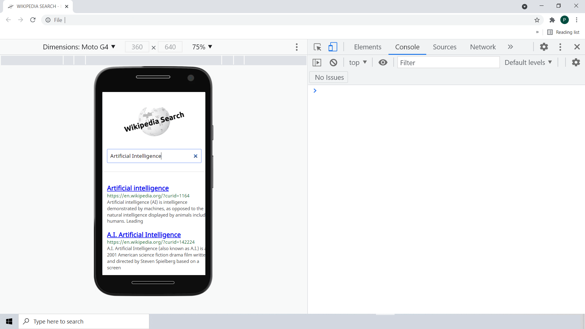
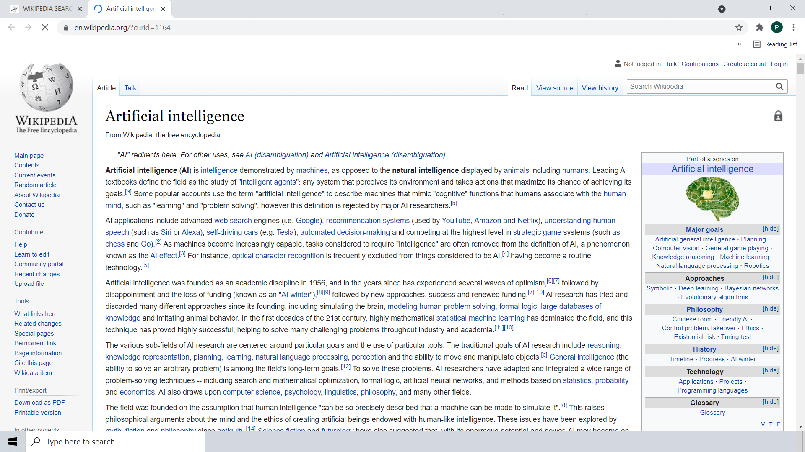

# My Hack The Valley 5.0 Hackathon Project
# Wikipedia-Search

- Type any keyword, Press Enter and Find the related Information from Wikipedia.
- Website made with HTML, CSS and JavaScript.
- Created with ❤ by Prashant Agheda 😊

# Result of the Project

---

---

---

---

---

# Try the Project Here
[Live Demo Here](https://easy-wikipedia-search.web.app/)

# Dev Post Project Link
To be added :)
